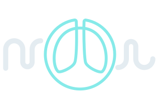
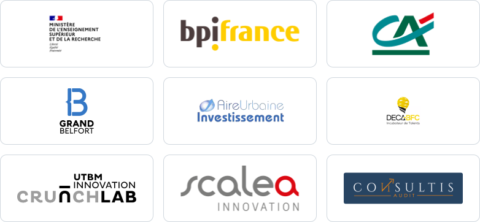

<picture>
  <source media="(prefers-color-scheme: dark)" srcset="../assets/logo_Nexsim_dark.svg">
  
</picture>

# NexSIM

**Des simulateurs pédagogiques pour la formation des professionnels de santé.**

---

NexSIM développe des outils de simulation destinés à la formation des soignants, avec un objectif
clair : réduire les erreurs médicales — notamment les événements indésirables graves — en améliorant
la communication des équipes et la maîtrise des gestes techniques.

## Notre approche

1. 🫁 **Des simulateurs physiques** reproduisant les comportements humains, connectés à
   de vrais dispositifs médicaux.
2. 🥽 **Des environnements virtuels** pour comprendre les pathologies « de l'intérieur ».
3. 🎓 **Un accompagnement pédagogique** complet, théorique et pratique.

## La suite logicielle « Nex »

| Application | Rôle |
|---|---|
| **NexControl** | Application de pilotage sur tablette : le formateur règle les modules physiques du simulateur et fait évoluer le scénario clinique en temps réel. |
| **NexVR** | Réalité virtuelle : visualiser l'impact d'une pathologie jusqu'au niveau alvéolaire, à partir des données temps réel du respirateur. |
| **NexScope** | Simulateur de moniteur multiparamétrique : constantes vitales (FC, TA, FR, SpO₂, ECG) modifiables par le formateur pour déclencher des réactions d'urgence. |
| **NexHome** | Écran d'accueil des tablettes NexSIM : un appareil prêt à l'emploi, verrouillé sur les applications de formation. |
| **Store** | Catalogue privé des applications NexSIM : installation et mises à jour automatiques des tablettes. |

## L'équipe

NexSIM est porté par cinq cofondateurs aux expertises complémentaires :

- **Jules Ferlin** — Président, ingénieur en informatique
- **Lucas Romary** — Responsable technique, ingénieur en mécatronique
- **Laurent Faivre** — Responsable formation, ingénieur pédagogique
- **Fabrice Lauri** — Responsable VR, maître de conférences en intelligence artificielle et réalité virtuelle
- **Jean-Sébastien Buvat** — Médecin anesthésiste-réanimateur, expertise clinique

## Partenaires

Ils nous font confiance :

*Établissement de santé, centre de simulation, industriel : vous souhaitez collaborer avec NexSIM ?
Écrivez-nous à [contact@nexsim.fr](mailto:contact@nexsim.fr).*

---

NexSIM — SAS immatriculée en France · <a href="https://www.nexsim.fr">www.nexsim.fr</a>

